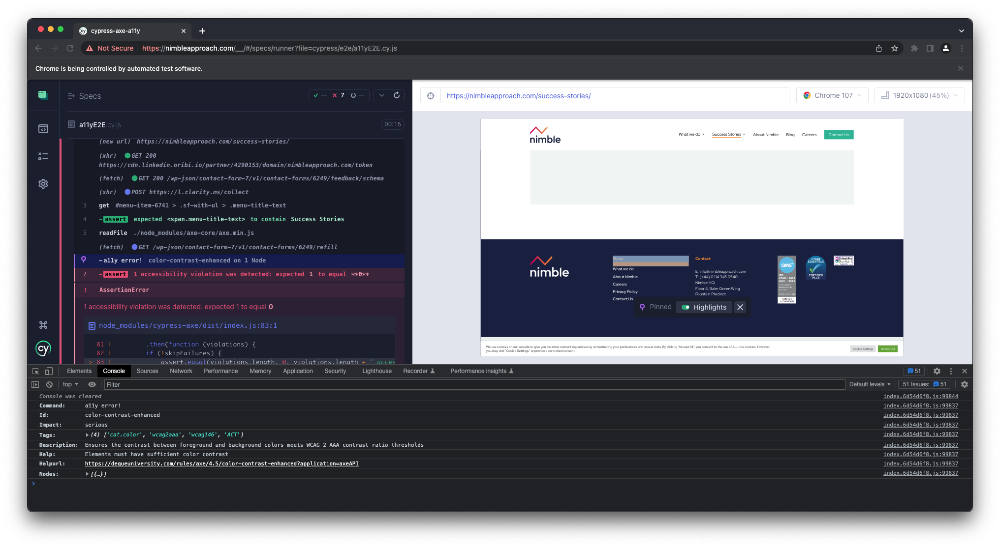

# Using the cypress-axe accessibility tests

This is a basic cypress framework that points to the Nimble website. 
It's then runs axe-core accessibility tests against the pages.

**Note - At the time of writing the package only works on cypress version 10.x**

The a11y tests have been wrapped in a cypress command called **cy.performA11yTests** and can accept the following parameters;

- **wcagStandards**  - Here you can define which standards you want to test against. For example the **Web Content Accessibility Guidelines (WCAG) 2 Level AA Conformance** or **wcag2aa** for short. A list of these can be found [here](https://www.deque.com/axe/core-documentation/api-documentation/#axe-core-tags)
- **impactLevel** - This defines the minimum level that will be reported on and can include 
    - minor
    - moderate
    - serious
    - critical
- **continueOnFail** - By default, a test will fail if something doesn't meet the minimum stand set. You might not want this in some case so the 'continueOnFail' option has been added. Currently it's set to false (Tests will fail if a violation is found).

Info on violations reported can be found in the console like so

More info about cypress-axe can be found on their GitHub page - https://github.com/component-driven/cypress-axe
To open cypress from the CLI cd to the cypress folder and run **npx cypress open**.
Alternatively, you can use the **npx cypress run** command to open the cypress runner window.